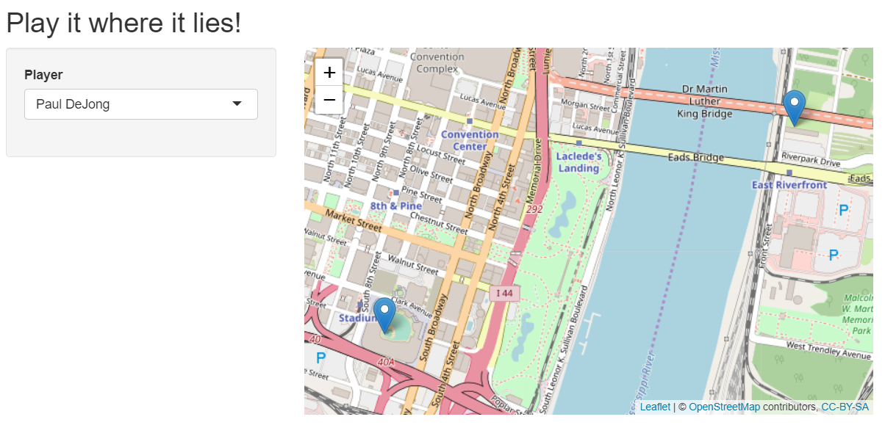
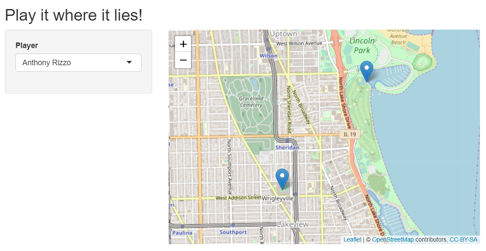

## Problem

The sport of baseball is becoming an increasingly data driven sport. From the 2002 Moneyball Athletics team looking to get the most value possible out of their payroll to sports betting algorithms: even the way we talk about the sport with friends has changed. If you think a player is the best, you better have some evidence in the form of advanced statistics like Wins Above Replacement or Weighted on base average to support your claim. And with the advent of systems like Statcast and PITCHf/x to track pitches, hits, and player movement we have more data than ever. We set out with a broadly defined problem, to answer unique questions, provide analysis, and produce visualizations using the treasure trove of baseball data we have today. And to implement the programming methods we learned in this course to do so.

## Hit it Where it Lies

Baseball media has also looked to data driven visualizations as a way to increase fan engagement. From the utilization of pitch location data to overlay a strike zone in real time, to leaderboards, to fan projects posted on Reddit these visualizations are found everywhere. We had an idea to create a visualization of quirky baseball statistics through a shiny application. The name of the app is “Hit it where it lies” and the premise is: what if everytime a player hit the ball, instead of being sent back to home plate the next time they have an at bat, they hit from the spot the last ball landed. How far would they get throughout the season? After the previously mentioned data processing we had a table that contained statcast measures of hit distance, as well as x and y coordinates of ball position at the end of a hit. We grouped these observations by player and created a total distance variable which was a sum of all of their individual hit distance values. We kept the players with the top 10 distances so far this season, and using data on the latitude and longitude of their respective stadium’s home plate and second base, scaled the measurement of their combined hits from feet to a latitude and longitude vector and plotted the final landing point on a map. Within the shiny app there’s a dropdown menu that lets you select one of the 10 players and the map automatically updates to show the total distance overlayed on their home ballpark. 

 

Here we can see Paul DeJong of the St Louis Cardinals has crossed the Mississippi River and has landed on the Illinois banks of East St Louis, and Anthony Rizzo of the Chicago Cubs has cleared the Sydney R Marovitz golf course and is sitting at the edge of the Montrose Harbor.

